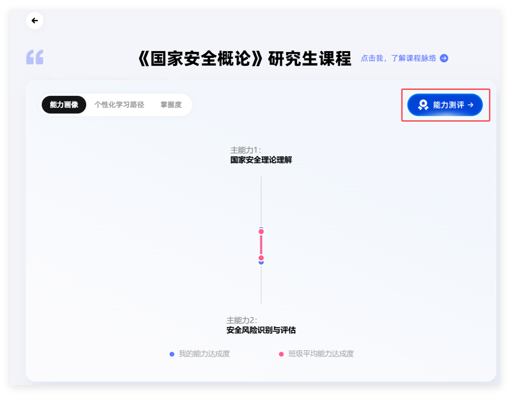
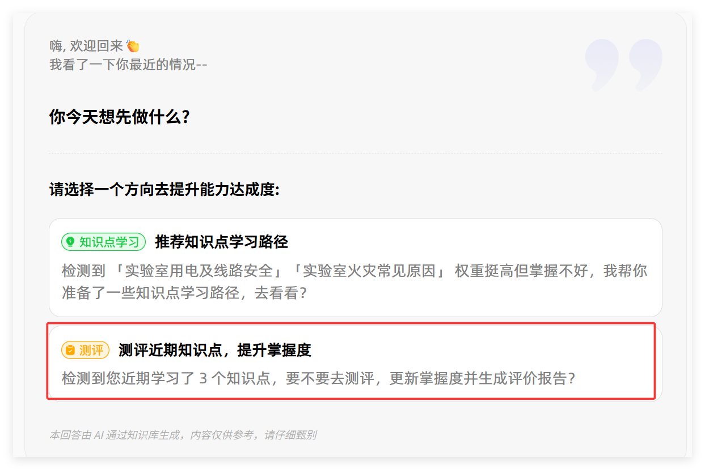
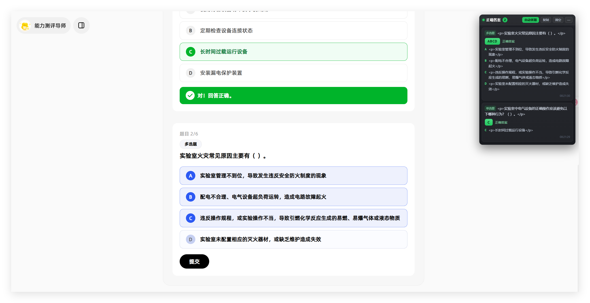
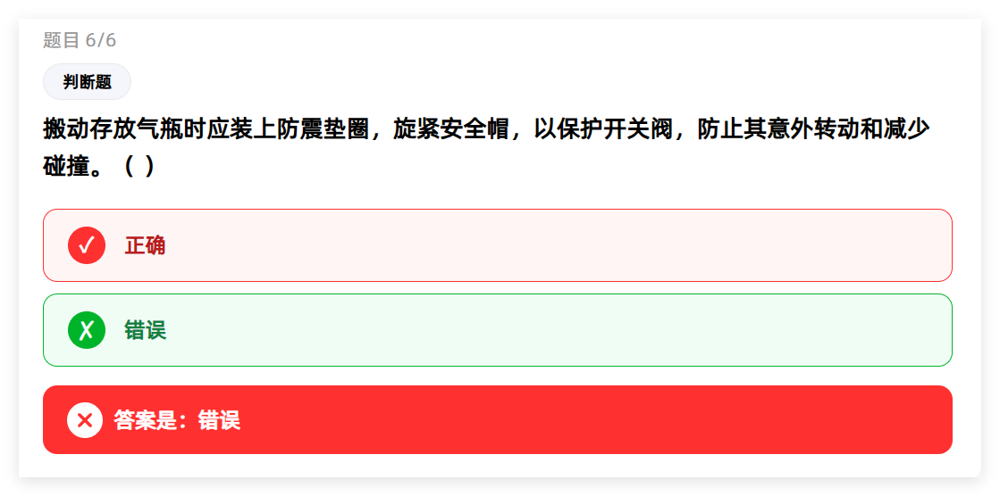
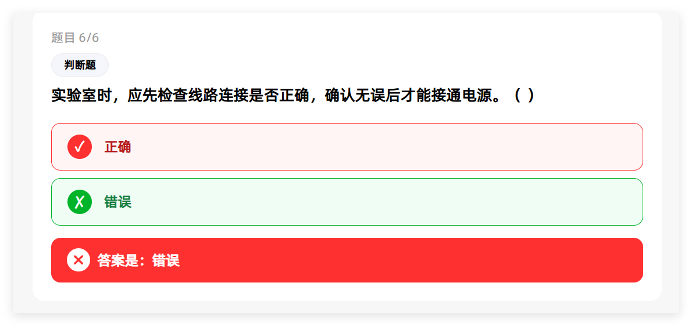
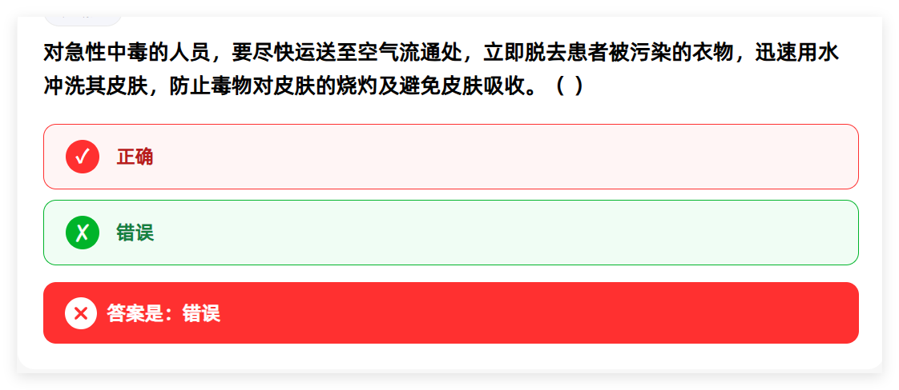

# 智慧树自动化油猴脚本

三个 Tampermonkey（油猴）用户脚本，配合使用可以自动刷完课程视频、自动做能力测评。

| 脚本 | 作用 |
| --- | --- |
| [zhihuishu-auto-next.user.js](./zhihuishu-auto-next.user.js) | 视频播完自动切到下一条（自动连播、倍速锁定） |
| [zhihuishu-get-evalution-question.user.js](./zhihuishu-get-evalution-question.user.js) | 实时抓取能力测评题目的正确答案，显示在右上角浮层里 |
| [zhihuishu-auto-evaluation.user.js](./zhihuishu-auto-evaluation.user.js) | 在上面那个的基础上，自动选中正确答案并提交测评报告 |

> ⚠️ 仅供个人学习与技术研究使用，请遵守学校及智慧树平台的规定。使用本脚本产生的一切后果由使用者自行承担。

---

## 一、安装

1. 浏览器（Chrome / Edge）先装好 [Tampermonkey（油猴）](https://www.tampermonkey.net/) 扩展。
2. 打开本仓库里某个 `.user.js` 文件的 Raw 链接，油猴会自动弹出安装页，点「安装」即可。
   - 也可以复制脚本全文 → 油猴面板 →「添加新脚本」→ 粘贴 → 保存。

> 两个答题脚本的匹配范围是全部网站（只对含题目接口的页面生效），数据全程只存在你自己浏览器里，不会上传。

---

## 二、视频自动连播

1. 打开课程的视频学习页。
2. **先手动点一次**左侧目录里正在学的那个视频，让脚本记住位置。
3. 之后正常播放就行，视频播完会自动切到下一条。
4. 右下角浮层可以看到进度，也能手动「下一条」、在 `1.0 / 1.25 / 1.5` 之间切换倍速。

---

## 三、能力测评自动答题

同时安装 `zhihuishu-get-evalution-question` 和 `zhihuishu-auto-evaluation` 两个脚本，然后按下面的步骤操作。
其中`zhihuishu-get-evalution-question` 仅能获得题目的正确选项，不能自动答题。`zhihuishu-auto-evaluation`包含了前者的功能，并能自动完成答题。因此两个脚本只需启动其中一个即可。

### 第 1 步：进入能力测评

在课程页面切到「能力画像」标签，点右上角的「能力测评」。

### 第 2 步：选择测评方向

在对话页里点「测评」那张卡片（测评近期知识点，提升掌握度）。

### 第 3 步：自动答题

进入答题页后脚本开始工作：右上角浮层实时显示抓到的正确答案，并自动帮你选好。多选题会自动点提交，单选题和判断题点选项即提交。

### 第 4 步：等报告生成后再来下一轮

答完会自动提交并生成评价报告。**报告出来之后先等 10 秒左右，再返回主页开启新的能力测评**，不然报告可能没生成完。

### ⚠️ 判断题的答案可能不准

受平台题库数据影响，**判断题给出的参考答案有时候是错的**，脚本会照平台返回的答案去选，所以判断题有可能被答错。碰到判断题建议自己看一眼，别完全依赖自动答题脚本。

下面是几个平台答案有误的实例：

---

## 四、免责声明

本项目仅用于前端自动化与用户脚本技术的学习研究。请在法律法规、学校与平台许可的范围内使用，作者不对使用本脚本造成的任何后果负责。

---

## 五、许可证

[MIT License](./LICENSE)
